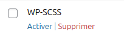

# Theme BLUE STEEL
## Stack
- [WP-SCSS](https://github.com/ConnectThink/WP-SCSS) : Module WordPress pour automatiquement compiler les SCSS du thème
- [SASS](https://sass-lang.com/documentation/) : préprocesseur CSS  

## Setup
### WP-SCSS
#### Activer le plugin
- Dans le backoffice de Wordpress, cliquez sur `Extensions` dans le menu de gauche.

- Sur la page, trouver le plugin WP-SCSS et cliquez sur `Activer`

- Une fois la page rechargée et le module activé, cliquez sur le lien `Settings` sous le nom de l'extension WP-SCSS

- Une fois sur la page `Settings` vous pouvez configurer l'extension ainsi puis sauvegarder :

- Cliquez sur le bouton `Enregistrer les modifications` tout en bas de la page

## Bonnes pratiques
### Je dois 